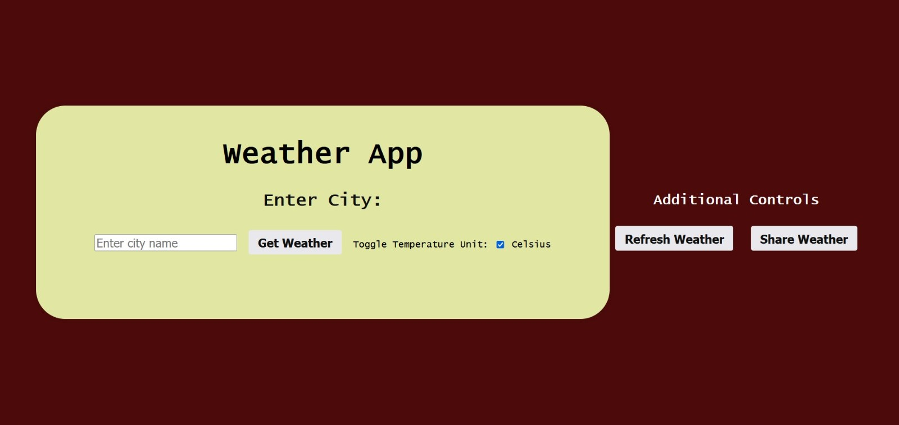
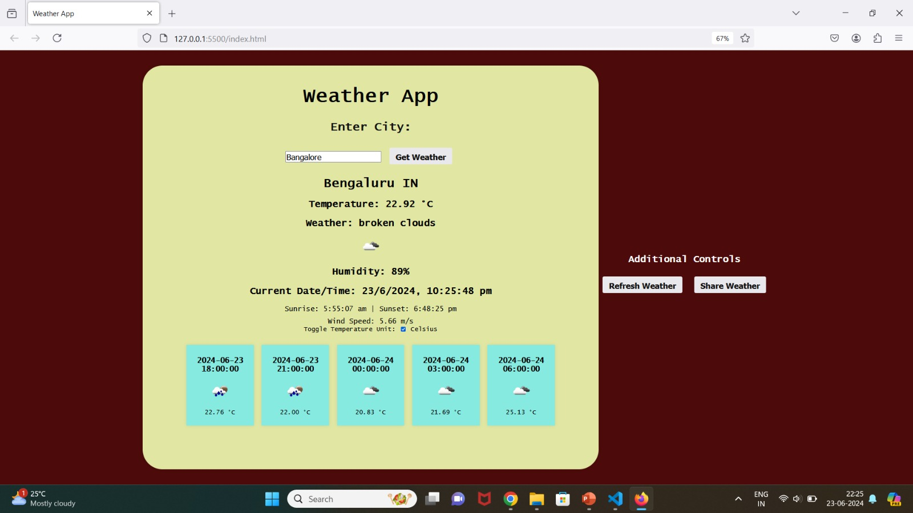

# Weather Application 🌦️

The **Weather Application** is a responsive and intuitive AngularJS-based app that provides real-time weather information. It delivers a seamless user experience with its clean interface, efficient API integration, and robust performance optimization. 

## Features 🚀

- **Real-Time Weather Updates**: Fetch current weather conditions for any location.
- **Intuitive Search**: Search by city name or geographic coordinates for quick results.
- **Weather Forecasts**: View detailed weather predictions for upcoming days.
- **Responsive Design**: Optimized for use across devices, including mobile, tablet, and desktop.
- **API Integration**: Utilizes reliable third-party weather APIs for accurate data.
- **Modular Architecture**: Built using AngularJS with a focus on code modularity and maintainability.
- **Performance Optimized**: Ensures a fast and smooth user experience.

## Technologies Used 🛠️

- **Frontend Framework**: AngularJS
- **API Integration**: [OpenWeather API](https://openweathermap.org/) or any other suitable weather data API
- **Styling**: CSS3 with responsive design principles
- **Build Tools**: npm, Bower (if used), and AngularJS CLI
- **Version Control**: Git and GitHub
## Usage 📖

- Enter a location in the search bar to fetch weather details.
- View real-time weather conditions such as temperature, humidity, and wind speed.
- Check forecasts for the next few days in the detailed forecast section.

To make your project documentation more visually engaging, here’s how you can add the paths for your screenshots:  

## 📸 Screenshots
1.**Home Page:**
   
2. **Weather Details for Delhi:**
   
3. **Weather Details for Chennai:**
   
4. **Weather Details for Bengaluru:**
   